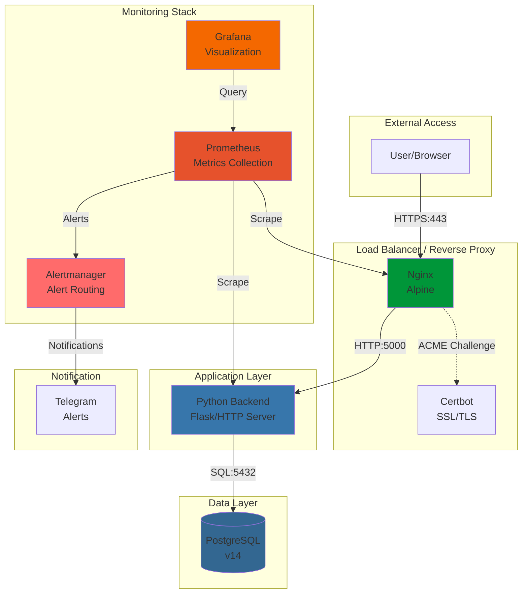

# DevOps Base - Full-Stack Infrastructure Project

A comprehensive DevOps infrastructure project demonstrating modern containerization, orchestration, monitoring, and security practices. This project showcases a complete production-ready setup with Docker Compose, Kubernetes, SSL/TLS encryption, and observability stack.


## 📋 Table of Contents

- [Project Overview](#project-overview)
- [Architecture](#architecture)
- [Tech Stack](#tech-stack)
- [Features](#features)
- [Prerequisites](#prerequisites)
- [Quick Start (Docker Compose)](#quick-start-docker-compose)
- [Kubernetes Deployment](#kubernetes-deployment)
- [SSL/TLS Setup](#ssltls-setup)
- [Monitoring & Alerting](#monitoring--alerting)
- [Environment Variables](#environment-variables)
- [Troubleshooting](#troubleshooting)
- [Future Roadmap](#future-roadmap)

## 🎯 Project Overview

This project is a complete DevOps infrastructure demonstration that implements:

- **Containerized Application Stack**: Python backend with Nginx reverse proxy and PostgreSQL database
- **Orchestration**: Both Docker Compose for local development and Kubernetes for production deployment
- **Security**: SSL/TLS encryption with Let's Encrypt for production and self-signed certificates for development
- **Observability**: Full monitoring stack with Prometheus, Grafana, and Alertmanager
- **Alerting**: Telegram integration for real-time service health notifications
- **Multi-Environment**: Separate configurations for development and production environments
- **Network Isolation**: Segregated frontend and backend networks for enhanced security

Perfect for demonstrating DevOps skills in a portfolio or as a foundation for real-world applications.

## 🏗️ Architecture



### Network Architecture

The project implements network segmentation for enhanced security:

- **frontend_net**: Exposed network for Nginx, Certbot, and monitoring services
- **backend_net**: Isolated network for backend and database communication
- **bridge driver**: Provides isolation between Docker networks

## 🛠️ Tech Stack

### Core Infrastructure
- **Docker & Docker Compose**: Containerization and orchestration for local development
- **Kubernetes**: Container orchestration for production deployments
- **Nginx (Alpine)**: High-performance reverse proxy and load balancer
- **PostgreSQL 14**: Relational database for data persistence

### Application
- **Python 3.12**: Backend application runtime
- **HTTP Server**: Built-in Python HTTP server for serving web content

### Security
- **SSL/TLS**: Encryption using Let's Encrypt (production) and self-signed certificates (development)
- **Certbot**: Automated certificate management and renewal
- **Security Headers**: HSTS, X-Frame-Options, X-Content-Type-Options, X-XSS-Protection

### Monitoring & Observability
- **Prometheus**: Metrics collection and storage
- **Grafana**: Metrics visualization and dashboards
- **Alertmanager**: Alert routing and management
- **Custom Alert Rules**: Service availability and latency monitoring

### Automation
- **Shell Scripts**: Automated deployment and certificate management
- **YAML Configuration**: Infrastructure as Code for Kubernetes manifests

## ✨ Features

### Application Features
- ✅ Responsive web interface with modern design
- ✅ Environment-aware configuration (development/production)
- ✅ Request logging with timestamps
- ✅ Health check endpoints for monitoring
- ✅ Database connectivity with PostgreSQL

### Infrastructure Features
- ✅ **Multi-Environment Support**: Separate configurations for dev and prod
- ✅ **Network Isolation**: Segregated networks for security
- ✅ **Persistent Storage**: Volume management for database and logs
- ✅ **Auto-Renewal SSL**: Automated certificate renewal with Certbot
- ✅ **Resource Limits**: CPU and memory constraints in Kubernetes
- ✅ **Health Checks**: Liveness and readiness probes
- ✅ **Rolling Updates**: Zero-downtime deployments

### Monitoring Features
- ✅ **Real-time Metrics**: Prometheus scraping every 15 seconds
- ✅ **Custom Dashboards**: Grafana visualization
- ✅ **Alert Routing**: Telegram notifications for critical issues
- ✅ **Service Availability Monitoring**: Automatic downtime detection
- ✅ **Latency Monitoring**: Performance threshold alerts
- ✅ **Historical Data**: Time-series database for trend analysis

## 📦 Prerequisites

### For Docker Compose Deployment
- **Docker**: Version 20.10 or higher
- **Docker Compose**: Version 2.0 or higher
- **OpenSSL**: For generating self-signed certificates (development)
- **Git**: For cloning the repository

### For Kubernetes Deployment
- **kubectl**: Kubernetes command-line tool
- **Minikube** or **Kind** (for local testing)
- **Access to a Kubernetes cluster** (for production)
- **Helm** (optional, for package management)

### For SSL/TLS (Production)
- **Domain name** pointed to your server
- **Port 80 (HTTP)** accessible from the internet
- **Port 443 (HTTPS)** accessible from the internet

### For Monitoring Alerts
- **Telegram Bot Token**: Create via @BotFather
- **Telegram Chat ID**: Your personal or group chat ID

## 🚀 Quick Start (Docker Compose)

### 1. Clone the Repository

```bash
git clone https://github.com/yourusername/devops-base-main.git
cd devops-base-main
```

### 2. Configure Environment Variables

Copy the development environment file:

```bash
cp .env.dev .env
```

Edit the `.env` file with your preferred configuration:

```bash
nano .env
```

### 3. Generate SSL Certificates (Development)

For local development, generate self-signed certificates:

```bash
chmod +x scripts/generate-self-signed-certs.sh
./scripts/generate-self-signed-certs.sh
```

This creates certificates in `./certs/conf/live/localhost/` valid for 365 days.

### 4. Start the Application Stack

```bash
docker-compose --env-file .env -f docker-compose.yml up -d
```

### 5. Start the Monitoring Stack

```bash
docker-compose --env-file .env -f monitoring/docker-compose.monitoring.yml up -d
```

### 6. Verify the Deployment

Check that all containers are running:

```bash
docker-compose ps
```

### 7. Access the Services

- **Application**: https://localhost (accept the self-signed certificate warning)
- **Prometheus**: http://localhost:9090
- **Grafana**: http://localhost:3000 (default credentials: admin/admin)
- **Alertmanager**: http://localhost:9093

### 8. Stop the Services

```bash
docker-compose --env-file .env -f docker-compose.yml -f monitoring/docker-compose.monitoring.yml down
```

## ☸️ Kubernetes Deployment

### 1. Prepare Kubernetes Cluster

Ensure you have a running Kubernetes cluster and `kubectl` configured:

```bash
kubectl cluster-info
kubectl get nodes
```

### 2. Build and Push Docker Image

Build the backend image and push to your container registry:

```bash
docker build -t yourusername/devops-base-backend:latest .
docker push yourusername/devops-base-backend:latest
```

Update the image reference in `k8s/backend-deployment.yaml` and `k8s/nginx-deployment.yaml`.

### 3. Configure Secrets and ConfigMaps

Edit `k8s/secret.yaml` to add your actual secrets:

```yaml
apiVersion: v1
kind: Secret
metadata:
  name: postgres-secret
  namespace: devops-base
type: Opaque
stringData:
  POSTGRES_PASSWORD: "your-secure-password"
  SECRET_KEY: "your-secret-key"
```

### 4. Deploy to Kubernetes

Use the provided deployment script:

```bash
chmod +x k8s-deploy.sh
./k8s-deploy.sh
```

Or deploy manually:

```bash
kubectl apply -f k8s/namespace.yaml
kubectl apply -f k8s/configmap.yaml
kubectl apply -f k8s/nginx-configmap.yaml
kubectl apply -f k8s/secret.yaml
kubectl apply -f k8s/postgres-statefulset.yaml
kubectl apply -f k8s/postgres-service.yaml
kubectl apply -f k8s/backend-service.yaml
kubectl apply -f k8s/nginx-service.yaml
kubectl apply -f k8s/backend-deployment.yaml
kubectl apply -f k8s/nginx-deployment.yaml
kubectl apply -f k8s/ingress.yaml
```

### 5. Verify Deployment

Check the status of all resources:

```bash
kubectl get all -n devops-base
kubectl get ingress -n devops-base
```

### 6. Access the Application

Add the ingress host to your `/etc/hosts` file:

```bash
echo "$(minikube ip) devops-base.local" | sudo tee -a /etc/hosts
```

Access the application at: http://devops-base.local

### 7. Cleanup

Use the cleanup script to remove all Kubernetes resources:

```bash
chmod +x k8s-cleanup.sh
./k8s-cleanup.sh
```

## 🔒 SSL/TLS Setup

### Development (Self-Signed Certificates)

For local development, use the provided script to generate self-signed certificates:

```bash
chmod +x scripts/generate-self-signed-certs.sh
./scripts/generate-self-signed-certs.sh
```

This creates certificates valid for 365 days for localhost and 127.0.0.1.

**Note**: Browsers will show security warnings for self-signed certificates. This is expected and safe for development.

### Production (Let's Encrypt)

#### Prerequisites

1. Ensure your domain is pointed to your server
2. Port 80 (HTTP) must be accessible from the internet
3. Install Certbot on your host system:

```bash
sudo apt update
sudo apt install certbot python3-certbot-nginx
```

#### Initial Certificate Obtainment

```bash
sudo certbot certonly --standalone -d yourdomain.com -d www.yourdomain.com
```

Or with Nginx:

```bash
sudo certbot --nginx -d yourdomain.com -d www.yourdomain.com
```

#### Certificate Location

After obtaining certificates, they will be located at:

- **Certificate**: `/etc/letsencrypt/live/yourdomain.com/fullchain.pem`
- **Private Key**: `/etc/letsencrypt/live/yourdomain.com/privkey.pem`
- **Chain**: `/etc/letsencrypt/live/yourdomain.com/chain.pem`

#### Configure Nginx

Update `nginx.conf` with your domain:

```nginx
server_name yourdomain.com www.yourdomain.com;
ssl_certificate /etc/letsencrypt/live/yourdomain.com/fullchain.pem;
ssl_certificate_key /etc/letsencrypt/live/yourdomain.com/privkey.pem;
```

#### Certificate Renewal

Certificates are valid for 90 days. Test renewal:

```bash
sudo certbot renew --dry-run
```

Auto-renewal is typically configured automatically. Check the timer:

```bash
sudo systemctl status certbot.timer
```

For detailed instructions, refer to the provided guide:

```bash
chmod +x scripts/setup-letsencrypt.sh
./scripts/setup-letsencrypt.sh
```

## 📊 Monitoring & Alerting

### Prometheus Configuration

Prometheus is configured to scrape metrics from:

- **Python Backend**: `backend:5000` every 15 seconds
- **Nginx Web Server**: `web:80` every 15 seconds

Configuration file: `monitoring/prometheus.yml`

### Alert Rules

Custom alert rules are defined in `monitoring/alert_rules.yml`:

#### ServiceDown Alert
- **Condition**: Service is down (`up == 0`)
- **Duration**: 30 seconds
- **Severity**: Critical
- **Description**: Service has been unavailable for more than 30 seconds

#### HighLatency Alert
- **Condition**: HTTP request duration > 1 second
- **Duration**: 1 minute
- **Severity**: Warning
- **Description**: Average response time exceeds 1 second

### Alertmanager Configuration

Alertmanager routes alerts to Telegram:

- **Group By**: Alert name
- **Group Wait**: 10 seconds before sending initial notification
- **Group Interval**: 5 minutes between notifications for the same group
- **Repeat Interval**: 1 hour before resending resolved alerts

### Telegram Integration

#### Setup Telegram Bot

1. Create a bot via [@BotFather](https://t.me/BotFather) on Telegram
2. Save the bot token provided
3. Get your chat ID by messaging [@userinfobot](https://t.me/userinfobot)

#### Configure Environment Variables

Add to your `.env` file:

```bash
TELEGRAM_BOT_TOKEN=your_bot_token_here
TELEGRAM_CHAT_ID=your_chat_id_here
```

#### Test Alerts

You can test alerts by stopping a service:

```bash
docker-compose stop backend
```

You should receive a Telegram notification within 30 seconds.

### Grafana Dashboards

Access Grafana at http://localhost:3000 (or your configured port):

1. Login with default credentials: `admin` / `admin`
2. Add Prometheus as a data source:
   - URL: `http://prometheus:9090`
   - Access: Server (default)
3. Import or create dashboards for:
   - Service uptime
   - Request latency
   - Resource utilization
   - Alert history

## 🔧 Environment Variables

### Application Configuration

| Variable | Description | Default | Required |
|----------|-------------|---------|----------|
| `APP_ENV` | Application environment | `development` | No |
| `APP_PORT` | Backend application port | `5000` | No |
| `LOG_PATH` | Path to log file | `/var/log/app/access.log` | No |
| `SECRET_KEY` | Application secret key | - | Yes |
| `COMPOSE_PROJECT_NAME` | Docker Compose project name | `dev-stack` | No |

### Database Configuration

| Variable | Description | Default | Required |
|----------|-------------|---------|----------|
| `POSTGRES_USER` | PostgreSQL username | `admin` | Yes |
| `POSTGRES_PASSWORD` | PostgreSQL password | - | Yes |
| `POSTGRES_DB` | PostgreSQL database name | `myapp` | Yes |
| `POSTGRES_HOST` | PostgreSQL host | `database` (Docker) / `postgres-service` (K8s) | No |
| `POSTGRES_PORT` | PostgreSQL port | `5432` | No |

### Nginx Configuration

| Variable | Description | Default | Required |
|----------|-------------|---------|----------|
| `NGINX_CONFIG` | Nginx configuration file | `nginx-local.conf` | No |

### Monitoring Configuration

| Variable | Description | Default | Required |
|----------|-------------|---------|----------|
| `PROMETHEUS_PORT` | Prometheus web UI port | `9090` | No |
| `GRAFANA_PORT` | Grafana web UI port | `3000` | No |
| `TELEGRAM_BOT_TOKEN` | Telegram bot token for alerts | - | Yes (for alerts) |
| `TELEGRAM_CHAT_ID` | Telegram chat ID for alerts | - | Yes (for alerts) |

### Environment-Specific Files

- **`.env.dev`**: Development environment configuration
- **`.env.prod`**: Production environment configuration

Copy the appropriate file to `.env` before deployment:

```bash
# For development
cp .env.dev .env

# For production
cp .env.prod .env
```

## 🔍 Troubleshooting

### Docker Compose Issues

#### Container Won't Start

**Problem**: Container fails to start or immediately exits

**Solution**:
```bash
# Check container logs
docker-compose logs backend
docker-compose logs web

# Verify environment variables
docker-compose config

# Rebuild containers
docker-compose down
docker-compose build --no-cache
docker-compose up -d
```

#### Port Already in Use

**Problem**: Port 80, 443, or other ports are already in use

**Solution**:
```bash
# Find process using the port
sudo lsof -i :80
sudo lsof -i :443

# Kill the process or change ports in .env
```

#### SSL Certificate Errors

**Problem**: Browser shows SSL certificate errors

**Solution**:
- For development: Accept the self-signed certificate warning
- For production: Ensure Let's Encrypt certificates are properly configured
- Check certificate paths in nginx.conf

```bash
# Verify certificate files exist
ls -la ./certs/conf/live/localhost/
```

### Kubernetes Issues

#### Pods Not Starting

**Problem**: Pods stuck in Pending or CrashLoopBackOff state

**Solution**:
```bash
# Check pod status
kubectl get pods -n devops-base

# Describe pod for detailed information
kubectl describe pod <pod-name> -n devops-base

# Check pod logs
kubectl logs <pod-name> -n devops-base

# Check events
kubectl get events -n devops-base
```

#### Image Pull Errors

**Problem**: Pods fail to pull Docker images

**Solution**:
```bash
# Verify image exists in registry
docker pull yourusername/devops-base-backend:latest

# Check image pull policy in deployment YAML
# Change to IfNotPresent for local testing

# Create image pull secret if using private registry
kubectl create secret docker-registry regcred \
  --docker-server=<your-registry> \
  --docker-username=<your-username> \
  --docker-password=<your-password> \
  -n devops-base
```

#### Ingress Not Working

**Problem**: Cannot access application via ingress

**Solution**:
```bash
# Check ingress status
kubectl get ingress -n devops-base

# Check ingress controller logs
kubectl logs -n ingress-nginx <ingress-controller-pod>

# Verify host mapping in /etc/hosts
ping devops-base.local

# Check ingress controller is installed
kubectl get pods -n ingress-nginx
```

### Monitoring Issues

#### Prometheus Not Scraping Metrics

**Problem**: Prometheus shows no targets or targets are down

**Solution**:
```bash
# Check Prometheus targets
# Access http://localhost:9090/targets

# Verify Prometheus configuration
cat monitoring/prometheus.yml

# Check network connectivity
docker-compose exec prometheus ping backend
docker-compose exec prometheus ping web

# Restart Prometheus
docker-compose restart prometheus
```

#### Grafana Cannot Connect to Prometheus

**Problem**: Grafana shows "Bad Gateway" or connection errors

**Solution**:
```bash
# Verify Prometheus data source configuration
# URL should be: http://prometheus:9090

# Check network connectivity
docker-compose exec grafana ping prometheus

# Restart Grafana
docker-compose restart grafana
```

#### Telegram Alerts Not Working

**Problem**: No Telegram notifications received

**Solution**:
```bash
# Verify environment variables
echo $TELEGRAM_BOT_TOKEN
echo $TELEGRAM_CHAT_ID

# Test Alertmanager configuration
# Access http://localhost:9093/#/status

# Check Alertmanager logs
docker-compose logs alertmanager

# Test Telegram bot manually
curl -X POST "https://api.telegram.org/bot<YOUR_BOT_TOKEN>/sendMessage" \
  -d "chat_id=<YOUR_CHAT_ID>" \
  -d "text=Test message"
```

### General Issues

#### Database Connection Errors

**Problem**: Backend cannot connect to PostgreSQL

**Solution**:
```bash
# Check database container status
docker-compose ps database

# Verify database credentials
docker-compose exec backend env | grep POSTGRES

# Test database connection
docker-compose exec backend ping database

# Check database logs
docker-compose logs database
```

#### High Resource Usage

**Problem**: Containers consuming excessive CPU or memory

**Solution**:
```bash
# Check resource usage
docker stats

# Adjust resource limits in docker-compose.yml
# Add resource limits to Kubernetes deployments

# Clean up unused resources
docker system prune -a
```

## � Development History

This section documents the progressive development journey of the DevOps Base project, showcasing the evolution from a basic containerized application to a comprehensive production-ready infrastructure. The development process demonstrates continuous learning and systematic skill building in modern DevOps practices.

### Project Evolution

The project has evolved through multiple phases, each building upon the previous one:

- **Initial Version**: Basic Docker Compose setup with a simple web application
- **Enhanced Version**: Added Kubernetes manifests, SSL/TLS configuration, and monitoring stack
- **Final Version**: Complete production-ready infrastructure with CI/CD, advanced monitoring, and comprehensive documentation

### Development Phases

#### Phase 1: Initial Setup (Docker Compose & Basic Stack)

**Accomplishments:**
- Created a functional Python web application with Flask/HTTP server
- Implemented Docker Compose orchestration for multi-container setup
- Configured Nginx as a reverse proxy for the application
- Set up PostgreSQL database with persistent volumes
- Created environment-specific configuration files (.env.dev, .env.prod)
- Implemented network isolation with separate frontend and backend networks
- Added basic logging and health check endpoints

**Technical Details:**
- Docker Compose configuration with service dependencies
- Volume management for data persistence
- Environment variable management for different deployment scenarios
- Basic Nginx configuration for HTTP routing

#### Phase 2: Kubernetes Deployment

**Accomplishments:**
- Created comprehensive Kubernetes manifests for all components
- Implemented StatefulSet for PostgreSQL to ensure data persistence
- Configured Deployments for backend and Nginx with rolling updates
- Set up Services for internal and external communication
- Implemented Ingress controller for external access
- Added ConfigMaps for configuration management
- Implemented Secrets for sensitive data (passwords, API keys)
- Created resource limits and requests for efficient resource utilization
- Added liveness and readiness probes for health monitoring
- Developed deployment and cleanup shell scripts for automation

**Technical Details:**
- Namespace isolation for multi-tenancy support
- Persistent Volume Claims for database storage
- Service discovery with Kubernetes DNS
- Ingress routing with host-based routing rules
- Resource management with CPU and memory constraints

#### Phase 3: CI/CD Implementation

**Accomplishments:**
- Designed GitHub Actions workflow for automated CI/CD pipeline
- Implemented YAML linting with yamllint for configuration validation
- Added automated Docker image building on push events
- Configured automated Docker Hub image pushing
- Set up multi-architecture support for Docker images
- Implemented workflow triggers for main branch and pull requests
- Added job dependencies for sequential pipeline execution
- Created environment-specific deployment configurations

**Technical Details:**
- GitHub Actions workflow with multiple jobs (lint, build, push)
- Docker buildx for multi-platform image building
- Conditional job execution based on branch
- Secret management for registry credentials
- Automated testing and validation before deployment

#### Phase 4: SSL/TLS Integration

**Accomplishments:**
- Implemented self-signed certificate generation for development
- Created automated certificate generation scripts
- Configured Nginx for SSL/TLS termination
- Set up Certbot integration for Let's Encrypt certificates
- Implemented certificate renewal automation
- Added security headers (HSTS, X-Frame-Options, X-Content-Type-Options)
- Created separate configurations for development and production
- Documented Let's Encrypt setup process for production deployment

**Technical Details:**
- OpenSSL certificate generation with proper extensions
- Nginx SSL configuration with modern cipher suites
- ACME challenge configuration for Let's Encrypt
- Certificate storage and volume mounting
- Security header implementation for enhanced protection

#### Phase 5: Monitoring and Alerting

**Accomplishments:**
- Deployed Prometheus for metrics collection and storage
- Configured Grafana for metrics visualization and dashboards
- Implemented Alertmanager for alert routing and management
- Created custom alert rules for service availability and latency
- Set up Telegram integration for real-time notifications
- Configured Prometheus scraping targets for backend and Nginx
- Created monitoring stack with Docker Compose
- Implemented alert grouping and notification policies
- Added historical data retention for trend analysis

**Technical Details:**
- Prometheus configuration with custom scrape intervals
- Alert rule definitions with severity levels
- Alertmanager routing with group wait and repeat intervals
- Telegram bot integration for alert notifications
- Grafana data source configuration and dashboard setup
- Custom metric endpoints in the application

### Technical Challenges Overcome

1. **Network Configuration**: Resolved Docker networking issues by implementing proper network isolation and service discovery
2. **Certificate Management**: Overcame SSL/TLS certificate challenges by creating automated generation and renewal scripts
3. **Kubernetes Resource Management**: Solved pod scheduling and resource allocation issues with proper limits and requests
4. **Database Persistence**: Implemented StatefulSet for PostgreSQL to ensure data persistence across pod restarts
5. **Monitoring Integration**: Successfully integrated multiple monitoring components with proper communication channels
6. **Alert Configuration**: Fine-tuned alert rules to avoid false positives while ensuring critical issues are detected
7. **CI/CD Pipeline**: Resolved authentication and permission issues for automated Docker image pushing
8. **Ingress Routing**: Configured proper ingress controller and host routing for external access

### Skills Demonstrated

**DevOps & Infrastructure:**
- Container orchestration with Docker Compose and Kubernetes
- Infrastructure as Code with YAML manifests
- CI/CD pipeline design and implementation
- Automated deployment and configuration management
- Multi-environment configuration management

**Security:**
- SSL/TLS certificate management
- Security header implementation
- Secrets management with Kubernetes Secrets
- Network isolation and segmentation
- Secure configuration practices

**Monitoring & Observability:**
- Metrics collection with Prometheus
- Visualization with Grafana
- Alert routing with Alertmanager
- Custom alert rule creation
- Real-time notification systems

**Automation & Scripting:**
- Shell scripting for deployment automation
- GitHub Actions workflow configuration
- Automated certificate generation
- Docker image building and pushing
- YAML validation and linting

**Configuration Management:**
- Environment variable management
- ConfigMap and Secret creation
- Nginx configuration for reverse proxy
- PostgreSQL database configuration
- Multi-environment setup

### GitHub Branches

The project maintains the following branches on GitHub:

- **main**: The current production-ready version with all features implemented
  - Complete Kubernetes manifests
  - CI/CD pipeline with GitHub Actions
  - SSL/TLS configuration (both self-signed and Let's Encrypt)
  - Full monitoring stack with Prometheus, Grafana, and Alertmanager
  - Telegram alert integration
  - Comprehensive documentation

- **initial-version**: The original basic implementation
  - Simple Docker Compose setup
  - Basic web application without advanced features
  - No Kubernetes deployment
  - No monitoring or alerting
  - Minimal documentation

This branch structure allows for comparison between the initial implementation and the enhanced production-ready version, demonstrating the learning progression and skill development throughout the project.

### Learning Outcomes

This project demonstrates a systematic approach to learning DevOps practices:

1. **Progressive Complexity**: Started with basic containerization and gradually added advanced features
2. **Hands-on Experience**: Practical implementation of each technology component
3. **Problem-Solving**: Overcame real-world technical challenges
4. **Best Practices**: Applied industry-standard DevOps practices throughout
5. **Documentation**: Maintained comprehensive documentation for each phase
6. **Automation**: Emphasized automation to reduce manual tasks
7. **Security First**: Integrated security considerations from the beginning
8. **Observability**: Implemented monitoring to ensure system reliability

This development history serves as a testament to the continuous learning process and the practical application of DevOps principles in building production-ready infrastructure.

## �🗺️ Future Roadmap

### Phase 1: Enhanced Monitoring
- [ ] Add custom application metrics (response time, request count)
- [ ] Implement distributed tracing with Jaeger
- [ ] Add log aggregation with ELK Stack (Elasticsearch, Logstash, Kibana)
- [ ] Create custom Grafana dashboards

### Phase 2: CI/CD Pipeline
- [ ] Implement GitHub Actions for automated testing
- [ ] Add automated Docker image building and pushing
- [ ] Implement automated Kubernetes deployments
- [ ] Add integration tests for the application

### Phase 3: High Availability
- [ ] Implement PostgreSQL replication (master-slave)
- [ ] Add Redis for caching and session management
- [ ] Implement database backup and restore procedures
- [ ] Add load balancing with multiple Nginx instances

### Phase 4: Security Enhancements
- [ ] Implement OAuth2/OpenID Connect authentication
- [ ] Add rate limiting to Nginx
- [ ] Implement secrets management with HashiCorp Vault
- [ ] Add security scanning to CI/CD pipeline
- [ ] Implement network policies in Kubernetes

### Phase 5: Cloud Integration
- [ ] Add Terraform configurations for cloud infrastructure
- [ ] Implement multi-cloud deployment strategy
- [ ] Add auto-scaling based on metrics
- [ ] Implement disaster recovery procedures

### Phase 6: Advanced Features
- [ ] Add WebSocket support for real-time features
- [ ] Implement message queue with RabbitMQ or Kafka
- [ ] Add API gateway with Kong or Ambassador
- [ ] Implement service mesh with Istio or Linkerd

## 📝 License

This project is licensed under the MIT License - see the LICENSE file for details.

## 🤝 Contributing

Contributions are welcome! Please feel free to submit a Pull Request.

## 📧 Contact

- **Telegram**: [@jowexsa](https://t.me/jowexsa)
- **Email**: gribanov.0812@gmail.com
- **Location**: Kemerovo, Russia

## 🙏 Acknowledgments

- Built with modern DevOps best practices
- Inspired by production-grade infrastructure patterns
- Designed for learning and portfolio demonstration

---

**Note**: This project is intended for educational and portfolio purposes. For production use, ensure proper security hardening, regular updates, and compliance with your organization's policies.
